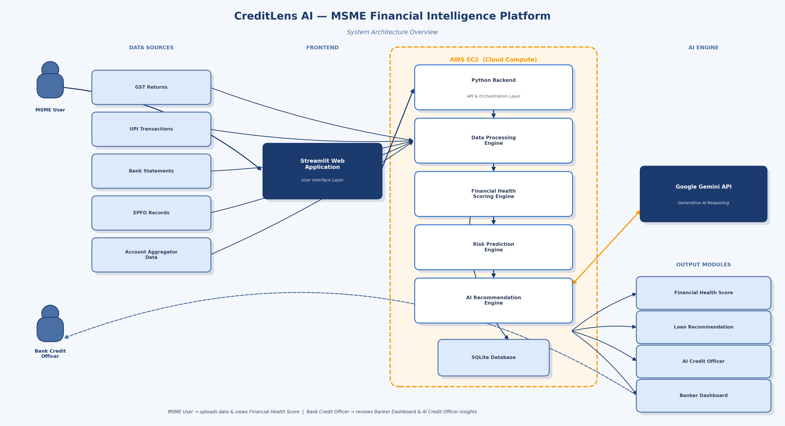

# 🏦 CreditLens AI – MSME Financial Health Copilot

<p align="center">
  
</p>

<p align="center">
  <strong>AI-Powered Financial Health Assessment Platform for MSMEs</strong><br>
  Built for <strong>IDBI Innovate Hackathon 2026</strong>
</p>

---

# 🌐 Live Demo

### 🚀 Application

**AWS EC2 Deployment**

**http://http://100.56.97.234/:8501**

> **Note:** The application is hosted on AWS EC2. If the instance is stopped for maintenance or cost optimization, the demo may be temporarily unavailable.

---

# 📂 GitHub Repository

**Repository**

https://github.com/Ankitaa0909/CreditLens-AI

---

## 📌 Overview

CreditLens AI is an AI-powered Financial Health Copilot designed to help banks assess the creditworthiness of **New-to-Credit (NTC)** and **New-to-Bank (NTB)** MSMEs using alternate financial data instead of relying solely on traditional financial statements.

The platform aggregates financial information from multiple sources such as **GST, UPI, Bank Statements, EPFO**, and **Account Aggregator (AA)** data to generate a multidimensional Financial Health Score, provide AI-driven insights, recommend suitable loan products, and enable explainable lending decisions.

---

## 🎯 Problem Statement

**Problem Statement 3 – Financial Health Score**

Traditional MSME credit evaluation depends heavily on audited financial statements and historical credit records, making it difficult for many deserving businesses to obtain financing.

CreditLens AI addresses this challenge by leveraging alternate financial data to provide:

- Near real-time credit assessment
- Explainable Financial Health Score
- AI-powered credit recommendations
- Loan readiness evaluation
- Improved financial inclusion

---

# ✨ Key Features

- 📊 Financial Health Score (0–100)
- 🤖 AI Credit Officer (LLM-powered assistant)
- 💰 Cash Flow Analysis
- 📑 GST Compliance Analysis
- 💳 UPI Transaction Insights
- 📈 Business Growth Analysis
- 🏦 Loan Readiness Score
- 💡 Personalized Loan Recommendations
- 🚨 Risk Radar Dashboard
- 🔮 What-If Financial Simulator
- 👨‍💼 Banker Portfolio Dashboard
- 🧠 Explainable AI Recommendations

---

# 🏗️ System Workflow

```text
MSME User
      │
      ▼
Upload Financial Documents
(GST / UPI / Bank Statement / EPFO)
      │
      ▼
Data Processing Engine
      │
      ▼
Financial Health Engine
      │
      ├── Cash Flow Analysis
      ├── Compliance Analysis
      ├── Growth Analysis
      ├── Risk Assessment
      └── Loan Readiness
      │
      ▼
AI Recommendation Engine
      │
      ▼
Interactive Dashboard
```

---

# 🏛️ System Architecture

> Add your architecture diagram here after creating it.

```text
architecture/system_architecture.png
```

Example:

```markdown

```

---

# 🛠 Technology Stack

| Layer | Technology |
|--------|------------|
| Frontend | Streamlit |
| Backend | Python |
| AI | Google Gemini API |
| Machine Learning | Scikit-learn |
| Data Processing | Pandas |
| Visualization | Plotly |
| Database | SQLite |
| Deployment | AWS EC2 |
| Version Control | Git & GitHub |

---

# 📁 Folder Structure

```text
creditlens-ai/
│
├── app.py
├── requirements.txt
├── README.md
├── LICENSE
├── SECURITY.md
├── CONTRIBUTING.md
├── .gitignore
│
├── ai/
├── architecture/
├── assets/
├── data/
├── models/
├── pages/
├── screenshots/
└── utils/
```

---

# 📈 Financial Health Score Model

| Parameter | Weight |
|------------|---------|
| Cash Flow | 30% |
| GST Compliance | 20% |
| Business Growth | 20% |
| Digital Transactions | 15% |
| Liquidity | 10% |
| Business Stability | 5% |

**Final Score = Weighted Average of all financial indicators**

---

# 🤖 AI Modules

## AI Credit Officer

Provides natural language explanations for:

- Business strengths
- Risk factors
- Loan eligibility
- Financial improvement suggestions

---

## Loan Recommendation Engine

Recommends loan products based on:

- Financial Health Score
- Repayment Capacity
- Cash Flow Stability
- Business Growth
- Compliance History

---

## What-If Financial Simulator

Allows bankers to simulate different business scenarios.

Examples:

- Increase revenue
- Delay GST filing
- Increase expenses
- Hire more employees
- Reduce UPI collections

The Financial Health Score updates instantly.

---

## Risk Radar

Evaluates:

- Compliance Risk
- Liquidity Risk
- Cash Flow Risk
- Business Stability
- Digital Adoption
- Repayment Capacity

---

# 📊 Dashboard Modules

### MSME Dashboard

- Financial Health Score
- Revenue Trends
- Expense Analysis
- Cash Flow
- Loan Readiness
- AI Insights

### Banker Dashboard

- Portfolio Overview
- Risk Segmentation
- Loan Recommendations
- MSME Rankings
- Credit Health Distribution

---

# 📸 Screenshots

> Replace these placeholders with actual screenshots after completing the application.

```markdown


```

---

# 🚀 Installation

Clone the repository

```bash
git clone https://github.com/Ankitaa0909/CreditLens-AI.git

cd CreditLens-AI
```

Create virtual environment

```bash
python3 -m venv venv
```

Activate

Linux

```bash
source venv/bin/activate
```

Windows

```powershell
venv\Scripts\activate
```

Install dependencies

```bash
pip install -r requirements.txt
```

Run

```bash
streamlit run app.py
```

---

# ☁️ Deployment

The application is deployed on an **AWS EC2 Ubuntu Server** using:

- Ubuntu Server
- Python 3.12
- Streamlit
- GitHub
- Virtual Environment

---

# 🔮 Future Scope

- Account Aggregator (AA) Integration
- OCEN Integration
- ULI Integration
- AI Fraud Detection
- OCR for Financial Documents
- Real-Time Banking APIs
- Automated Credit Underwriting
- Credit Monitoring Alerts

---

# 🎥 Demo Workflow

1. Upload MSME Financial Data
2. Generate Financial Health Score
3. Review AI Insights
4. Simulate Business Scenarios
5. View Loan Recommendations
6. Analyze Banker Dashboard

---

# ⚠️ Disclaimer

This project has been developed solely for the **IDBI Innovate Hackathon 2026**.

The financial datasets used are simulated for demonstration purposes only.

No real customer banking information is stored or processed.

---

# 👩‍💻 Author

**Ankita Kadam**

Cloud Engineer | DevOps Engineer | AI Enthusiast

GitHub:
https://github.com/Ankitaa0909

---

# 🙏 Acknowledgements

- IDBI Bank
- Hack2Skill
- Google Gemini API
- Streamlit
- Plotly
- Scikit-learn
- Pandas
- AWS

---

# 📜 License

This project is licensed under the MIT License.

---

<p align="center">

⭐ If you found this project useful, consider giving it a star!

Made with ❤️ for IDBI Innovate Hackathon 2026

</p>
